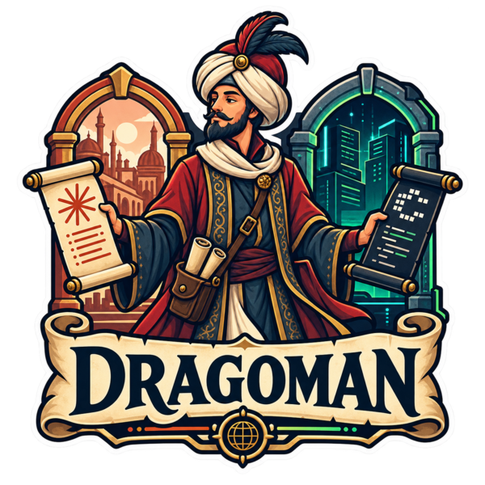

<p align="center"></p>

# Dragoman

A Claude Code plugin that translates between Claude and Codex so that Codex feels native. 
Dragoman translates between them — so Codex's approvals, progress, and permissions feel 
like they were built into Claude all along.

> A _dragoman_ was the **interpreter-diplomat** who let two courts speaking **different
languages** do business. That is exactly this tool's job.


## Why

Codex is a superb agent trapped behind a batch-job interface. The official plugin
runs it like a black box: when Codex pauses to ask _"may I run this?"_ the plugin
**rejects the request and hangs** — your only escape is to switch the sandbox off
(`danger-full-access`) and hope. You watch **one final blob**, never the work in
flight. And **none of Claude's permissions, modes or sandbox rules reach Codex**, so
you run it without the guardrails you carefully set.

Dragoman talks to Codex's supported **app-server** and wires its approvals, progress
and permissions straight onto Claude Code's own machinery:

| On the axes that matter | Official Codex plugin | Dragoman |
|---|---|---|
| Approvals | hang — must disable the sandbox | native async prompt, in Claude's own UI |
| Progress | one final blob | live heartbeat you can poll |
| Permissions, mode & sandbox | not mapped | mirror Claude's live settings, per turn |

## The idea in one line

**Mirror Claude, don't reinvent it.** Dragoman reads Claude Code's own settings and mirrors
them onto Codex per turn. It only asks you a question when Claude's own policy can't answer — and when it
does, it uses Claude's native approval prompt.

## What's mapped

Each Claude permission **mode** becomes a Codex posture:

| Claude mode | Codex behaviour |
|---|---|
| `plan` | Native Codex plan mode — reads run, writes refused at the source, no prompts |
| `default` / `manual` | Reads auto-run; every edit or write escalates to a native approval |
| `acceptEdits` | In-workspace edits auto-run; anything escaping the workspace escalates |
| `auto` | Escapes are judged by Codex's own safety classifier |
| `dontAsk` | Only pre-approved commands and reads run; everything else refused, never asked |
| `bypassPermissions` | Everything runs, unconfined — no sandbox, no prompts |

And each relevant **setting** is mirrored onto the Codex run:

| Claude Code | → Codex | |
|---|---|---|
| Permission mode | approval policy + reviewer + sandbox scope (above) | ✅ |
| Sandbox scope (read-only / workspace-write / danger) | permission-profile base | ✅ |
| `permissions.additionalDirectories` | `runtimeWorkspaceRoots` (writable roots) | ✅ |
| `sandbox.filesystem.allow`/`denyRead`/`denyWrite`/`allowWrite` | profile `filesystem` path→access table | ✅ |
| Network on/off (mirrors Claude's real posture) | profile `network.enabled` | ✅ |
| `sandbox.network.allowedDomains` / `deniedDomains` / `WebFetch(domain:)` | per-host allow/deny via Codex's network proxy | ✅ |
| `permissions.allow` Bash rules | auto-accept (execpolicy) | ✅ |
| `permissions.deny` Bash rules | pre-decline (execpolicy, fail-closed) | ✅ |
| Approvals for anything uncovered | **async native elicitation** | ✅ |
| Codex progress | **sparse heartbeat**, surfaced on poll | ✅ |

Mirroring runs against an **isolated `CODEX_HOME`** (auth inherited from `~/.codex`,
config = your config + a managed profile block), so it never touches your real
Codex config. Full per-setting detail — with the one mapping that can't be faithful
— is in [`docs/MAPPING.md`](docs/MAPPING.md); the design and ethos in
[`docs/DESIGN.md`](docs/DESIGN.md).

## Install

Dragoman is a Claude Code plugin. Add the marketplace and install it:

```
/plugin marketplace add danielbodart/dragoman
/plugin install dragoman@danielbodart 
```

That pulls a small archive (~280 KB) carrying the server as a single bundled
JS. It runs with [**Bun**](https://bun.sh) — which must be on your `PATH`
(a SessionStart hook warns if it is missing) — so there is no per-platform
binary and no multi-megabyte download. Codex must also be on your `PATH`
(Dragoman spawns `codex app-server`).

Once installed you get:

- **`/dragoman:codex`** — the skill Claude loads to hand a task to Codex from the prompt.
- the **`dragoman:codex-agent` subagent** — Claude delegates to it for a second
  implementation, an independent review, or a deep investigation; it drives the
  run, follows the heartbeat, and reports back in Codex's voice.
- the underlying **`codex_run` / `codex_status`** MCP tools (exposed as
  `mcp__plugin_dragoman_dragoman__…`), if you'd rather drive Codex directly.

### From source

```bash
mise run build                                             # bundle → dist/dragoman.js
claude mcp add dragoman -s user -- bun "$PWD/dist/dragoman.js" serve
mise run package                                           # or the full plugin archive → dist/dragoman-plugin.zip
```

## License

Copyright 2026 Daniel Bodart. Licensed under the [Apache License 2.0](LICENSE).
